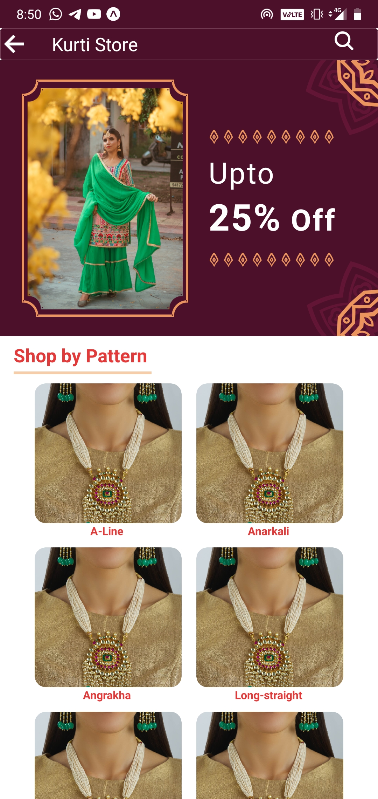

# Basic Fashion Store app

## Prerequisites

[Install node](https://nodejs.org/en/download/)

[Install npm](https://www.npmjs.com/get-npm)

[Install Expo](https://docs.expo.io/)

## Screenshots
 
 <tr>
    <td></td>
    <td></td>
    <td></td>
  </tr>